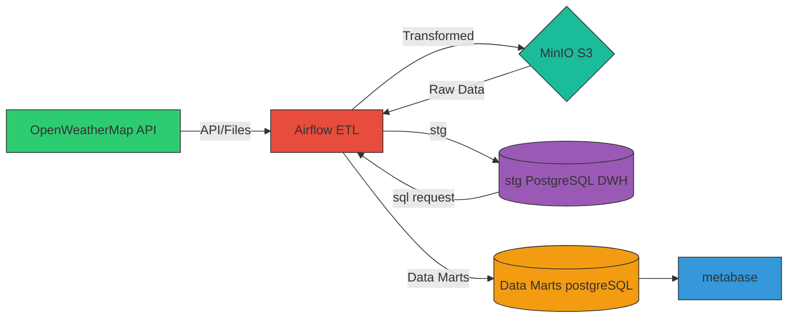

## Архитектура проекта

```mermaid
graph LR
    A[OpenWeatherMap API] -->|API/Files| D[Airflow ETL]
    D --> |Transformed| C{MinIO S3} 
    C -->|Raw Data| D[Airflow ETL]
    D -->|stg| E[(stg PostgreSQL DWH)]
    E -->|sql request| D[Airflow ETL] 
    D --> |Data Marts| B[(Data Marts postgreSQL)]
    B --> F[metabase]

style A fill:#2ecc71,stroke:#333
style B fill:#f39c12,stroke:#333
style C fill:#1abc9c,stroke:#333
style D fill:#e74c3c,stroke:#333
style E fill:#9b59b6,stroke:#333
style F fill:#3498db,stroke:#333
```
## 📝  Пример итогового дашборда
![Preview PDF]https://github.com/MaximSI81/meteo_data/blob/master/meteodata.pdf

